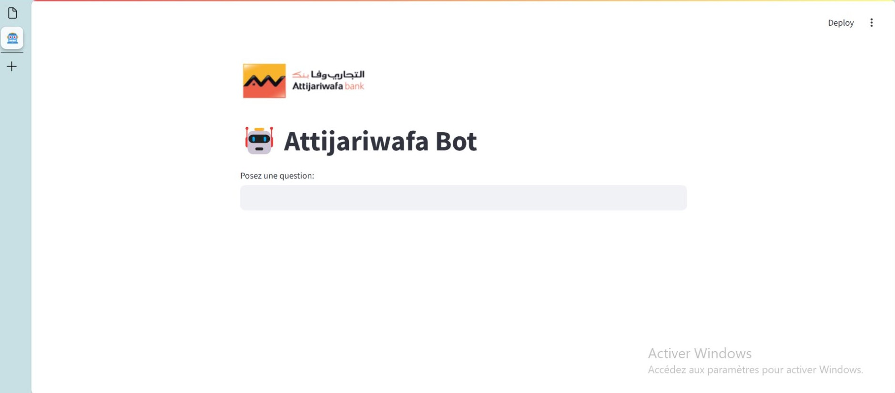
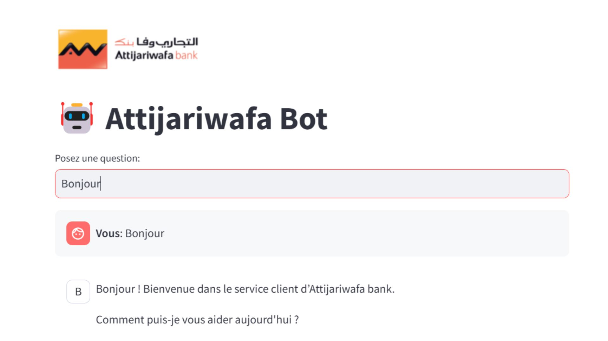
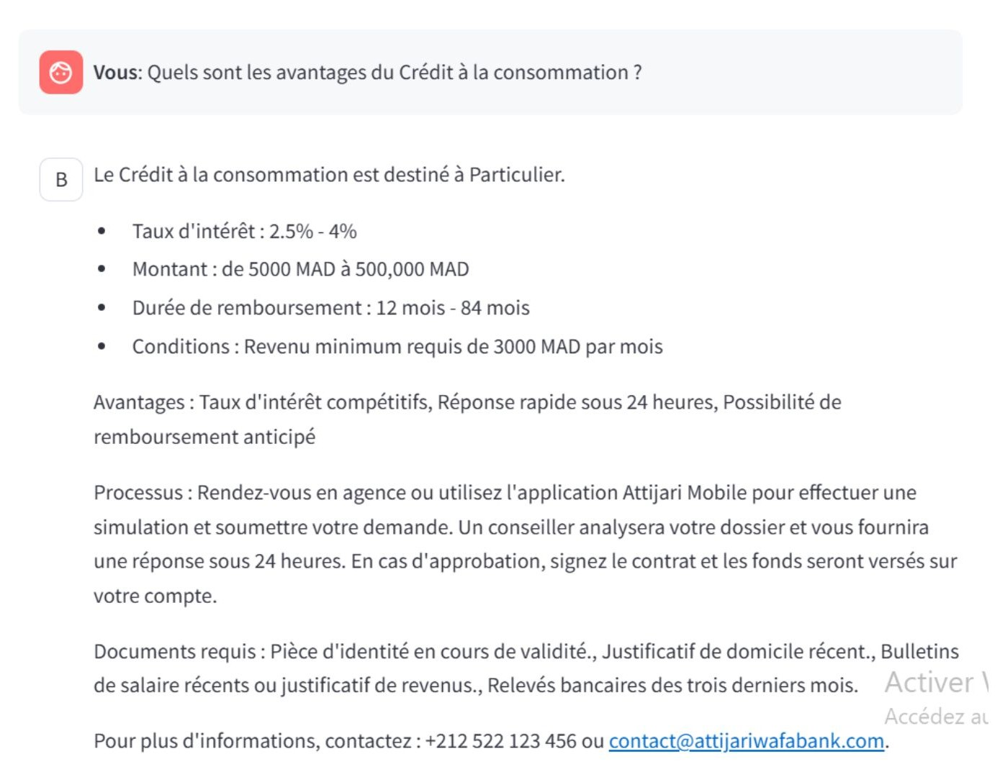

# 🤖 Chatbot RAG pour Service Client - Attijariwafa Bank

**Chatbot intelligent** combinant un modèle de classification d'intentions et une recherche RAG pour répondre aux questions des clients, avec prise en charge des requêtes simples, complexes et hors sujet.

## ✨ Fonctionnalités clés
- **Classification intelligente** : Distingue automatiquement :
  - ✅ **Requêtes simples** : Réponses instantanées depuis le fichier `intents.json`
  - 🔍 **Requêtes complexes** : Réponses générées par recherche RAG dans les documents PDF
  - ❓ **Hors sujet** : Reconnaissance des questions non pertinentes

- **Stack technique** :
  - Python + Streamlit (interface)
  - Modèle de classification custom (scikit-learn)
  - RAG avec Gemini API (pour les requêtes complexes)

## 📸 Exemples d'utilisation
### Interface du chatbot


### Exemple de requête simple


### Exemple de requête complexe


### Intégration web


## 🚀 Installation rapide
1. **Cloner le dépôt** :
   ```bash
   git clone https://github.com/Nimat13/Projects_NimatAllahKhaldoune.git
   cd Projects_NimatAllahKhaldoune
   ```
2. **Clé API Gemini** :
    - Obtenez une clé sur Google AI Studio
    - Ajoutez-la dans chatbot.py
3. **Entraînement (si nécessaire)** :
    ```bash
    python trainings.py  # Génère les fichiers .pkl
    ```
4. **Lancer l'application** :
    ```bash
    streamlit run app.py
    ```